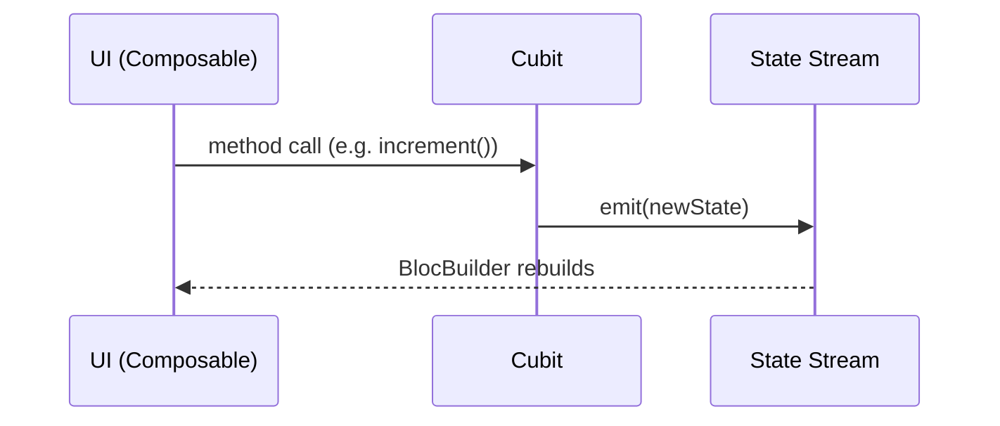
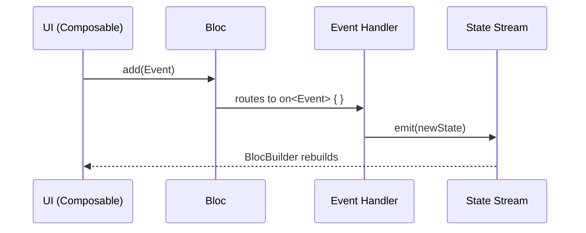
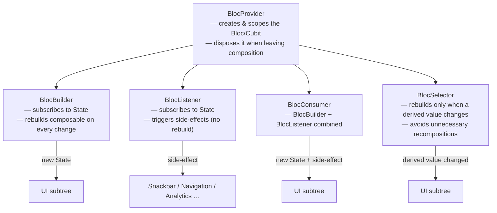
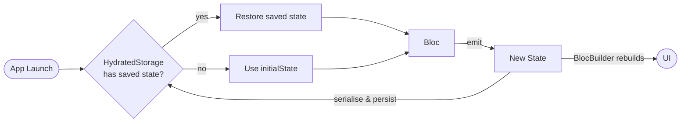
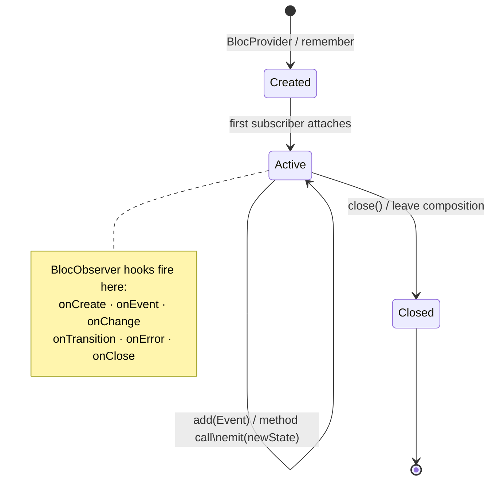

# BlocKotlin

[](https://github.com/sergiofraile/BlocKotlin/actions/workflows/ci.yml)
[](https://central.sonatype.com/artifact/io.github.sergiofraile/bloc)
[](LICENSE)

An Android showcase of the **Bloc** state-management pattern written in Kotlin and Jetpack Compose, mirroring the iOS Swift implementation at [BlocSwift](https://github.com/sergiofraile/BlocSwift).

> **Inspiration** — This project is directly inspired by the [Bloc library for Dart/Flutter](https://bloclibrary.dev). The core concepts (Cubit, Bloc, HydratedBloc, BlocObserver, EventTransformer, and all Compose integration widgets) map 1-to-1 to their Dart counterparts. If you are familiar with `flutter_bloc`, you will feel right at home.

The project is split into two modules:

| Module | Purpose |
|--------|---------|
| `:bloc` | Pure-Kotlin Bloc library — `Cubit`, `Bloc`, `HydratedBloc`, Compose integration, `BlocObserver`, `EventTransformer` |
| `:app`  | Sample Android application — 7 interactive examples built with Jetpack Compose |

---

## Bloc Pattern

### Cubit — direct method calls

A `Cubit` is the simplest building block. The UI calls methods directly on the Cubit; the Cubit calls `emit()` to push a new state; every `BlocBuilder` subscribed to that Cubit rebuilds.



---

### Bloc — event-driven

A `Bloc` adds an explicit **Event** layer on top of Cubit. The UI dispatches sealed-class events; the Bloc processes them through registered handlers; each handler calls `emit()` to produce a new state.



---

### Compose integration widgets



---

### HydratedBloc — persistence

`HydratedBloc` extends `Bloc` with automatic state serialisation. On the first run the initial state is used; on every subsequent launch the last persisted state is restored from `HydratedStorage` before any events are processed.



---

### Full lifecycle



---

## Architecture

```
BlocKotlin/
├── bloc/                          # Library module (KMP-ready)
│   └── src/main/kotlin/dev/bloc/
│       ├── BlocBase.kt            # StateEmitter interface
│       ├── Cubit.kt
│       ├── Bloc.kt
│       ├── HydratedBloc.kt
│       ├── HydratedStorage.kt
│       ├── SharedPreferencesStorage.kt
│       ├── BlocObserver.kt
│       ├── EventTransformer.kt
│       ├── Change.kt / Transition.kt / BlocError.kt
│       └── compose/
│           ├── BlocProvider.kt
│           ├── BlocBuilder.kt
│           ├── BlocListener.kt
│           ├── BlocSelector.kt
│           └── BlocConsumer.kt
└── app/                           # Sample application
    └── src/main/kotlin/dev/bloc/sample/
        ├── examples/
        │   ├── counter/           # HydratedBloc + persistence
        │   ├── stopwatch/         # Cubit + async tick loop
        │   ├── calculator/        # Lifecycle hooks + live log
        │   ├── heartbeat/         # Scoped Bloc lifecycle
        │   ├── scoreboard/        # BlocListener + BlocConsumer
        │   ├── formulaone/        # Async API + enum states
        │   └── lorcana/           # Debounce + infinite scroll + BlocSelector
        ├── navigation/            # ListDetailPaneScaffold adaptive layout
        └── ui/                    # Theme, HomeScreen
```

---

## Requirements

| Tool | Version |
|------|---------|
| Android Studio | Meerkat (2024.3.1+) |
| JDK | 17+ |
| Kotlin | 2.0.21 |
| AGP | 9.0.1 |
| Gradle | 9.2.1 |
| Min SDK | 26 |
| Target SDK | 36 |
| Compose BOM | 2024.12.01 |

---

## Using the library

`mavenCentral()` is already in every Android project's `settings.gradle.kts`, so no repository change is needed. Just add the dependency:

```kotlin
dependencies {
    implementation("io.github.sergiofraile:bloc:1.0.0")
}
```

Replace `1.0.0` with the [latest version on Maven Central](https://central.sonatype.com/artifact/io.github.sergiofraile/bloc).

---

## Getting Started (sample app)

```bash
git clone https://github.com/sergiofraile/BlocKotlin
cd BlocKotlin
./gradlew :app:installDebug
```

Open in Android Studio → **Sync Project with Gradle Files** → Run on device or emulator.

---

## Examples

### 1. Counter — `HydratedBloc`

Demonstrates state persistence across app restarts using `SharedPreferences`. The count survives process death.

```kotlin
class CounterBloc : HydratedBloc<Int, CounterEvent>(
    initialState  = 0,
    serializer    = serializer(),
    storageKeyParam = "counter",
) {
    init {
        on<CounterEvent.Increment> { _, emit -> emit(state + 1) }
        on<CounterEvent.Decrement> { _, emit -> emit(state - 1) }
        on<CounterEvent.Reset>     { _, emit -> emit(0) }
    }
}
```

---

### 2. Stopwatch — `Cubit`

Demonstrates direct method calls instead of events. A coroutine tick loop drives state at 100 Hz.

```kotlin
class StopwatchCubit : Cubit<StopwatchState>(StopwatchState.initial) {
    fun start() { ... }
    fun pause() { ... }
    fun reset() { ... }
}
```

---

### 3. Calculator — Lifecycle Hooks

Shows all five lifecycle hooks (`onEvent`, `onChange`, `onTransition`, `onError`, `onClose`) feeding a live log panel.

---

### 4. Heartbeat — Scoped Lifecycle

The Bloc is **not** in a global provider. It is `remember`ed by the composable, started on `LaunchedEffect`, and closed by `DisposableEffect { onDispose { bloc.close() } }`. Navigate away to see `onClose` fire instantly.

---

### 5. Score Board — `BlocListener` · `BlocConsumer`

Three reactive layers in one screen:

| Component | Predicate | Behaviour |
|-----------|-----------|-----------|
| `BlocListener` | `score % 5 == 0` | Shows milestone banner (side-effect only) |
| `BlocBuilder` | every point | Updates score numeral |
| `BlocConsumer` | tier boundary (every 10 pts) | Rebuilds tier badge **and** pulses it |

---

### 6. Formula One — Async API

Fetches live F1 Driver Championship data from [f1api.dev](https://f1api.dev). Demonstrates a sealed `FormulaOneState` (Initial / Loading / Loaded / Error) driven by async network calls inside a `Bloc`.

---

### 7. Lorcana — Debounce · Infinite Scroll · `BlocSelector`

Searches the [Lorcana API](https://api.lorcana-api.com) with a 300 ms debounce transformer. Infinite scroll is triggered when the `LazyColumn` nears its end. Two `BlocSelector` instances drive the footer without recomposing the card list.

```kotlin
// Debounce transformer — registered once in LorcanaBloc
on<LorcanaEvent.Search>(transformer = EventTransformer.Debounce(300.milliseconds)) { event, emit ->
    // fires only after 300 ms of silence
    val cards = networkService.searchCards(event.query, ...)
    emit(state.copy(cards = cards))
}

// BlocSelector — footer recomposes only when isLoadingMore changes
BlocSelector(bloc = lorcanaBloc, selector = { it.isLoadingMore }) { isLoadingMore ->
    if (isLoadingMore) LoadingFooter()
}
```

---

## Responsive Layout

The app uses `ListDetailPaneScaffold` (Material3 Adaptive) to deliver a split-view experience:

- **Phone (compact)**: list navigates to detail, hardware back returns to list.
- **Foldable / tablet (expanded)**: list stays on the left, selected example fills the right pane.

---

## Debugging

Bloc lifecycle events are routed to **Logcat** via `AppBlocObserver`:

```
D/BlocObserver: onCreate CounterBloc
D/BlocObserver: onEvent CounterBloc — Increment
D/BlocObserver: onChange CounterBloc — Change(0 → 1)
D/BlocObserver: onTransition CounterBloc — Transition(0, Increment, 1)
```

Filter by tag `BlocObserver` in Android Studio's Logcat to see all events in real time.

---

## Running Unit Tests

```bash
./gradlew :bloc:test
```

Or in Android Studio: **Run** → **Edit Configurations** → **+** → **JUnit** → Module: `bloc.test`, Method: all.

---

## iOS Counterpart

The iOS Swift implementation lives at [BlocSwift](https://github.com/sergiofraile/BlocSwift).

The Bloc library API is intentionally parallel — `Bloc`, `Cubit`, `HydratedBloc`, `BlocObserver`, `EventTransformer`, `BlocListener`, `BlocBuilder`, `BlocSelector`, `BlocConsumer` all exist in both implementations with matching semantics. The `:bloc` Kotlin module is structured to be KMP-ready for future cross-platform sharing.

---

## Contributing

Contributions are welcome! Please read [CONTRIBUTING.md](CONTRIBUTING.md) before opening a pull request or issue.

---

## Changelog

See [CHANGELOG.md](CHANGELOG.md) for a history of notable changes.

---

## License

This project is licensed under the **Apache License, Version 2.0**. See the [LICENSE](LICENSE) file for details.

```
Copyright 2026 Sergio Fraile

Licensed under the Apache License, Version 2.0 (the "License");
you may not use this file except in compliance with the License.
You may obtain a copy of the License at

    http://www.apache.org/licenses/LICENSE-2.0
```
