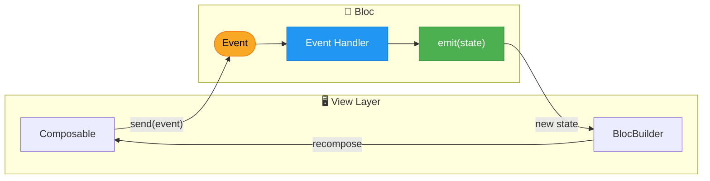
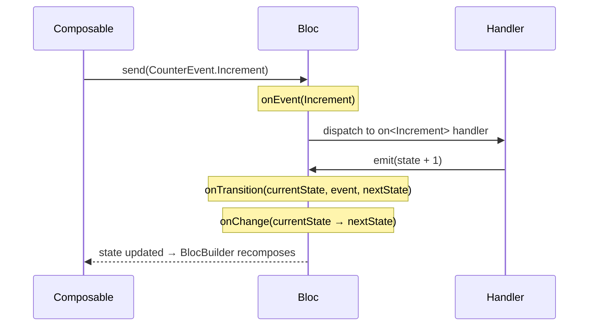
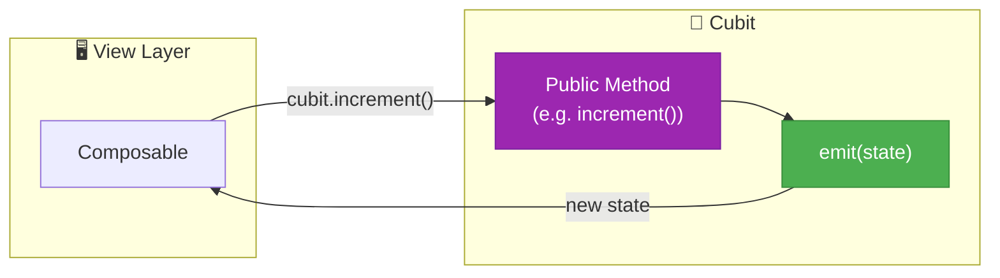

# BlocKotlin

[](https://github.com/sergiofraile/BlocKotlin/actions/workflows/ci.yml)
[](https://central.sonatype.com/artifact/io.github.sergiofraile/bloc)
[](LICENSE)

> **Android/Kotlin:** [github.com/sergiofraile/BlocKotlin](https://github.com/sergiofraile/BlocKotlin) · **iOS/Swift counterpart:** [github.com/sergiofraile/BlocSwift](https://github.com/sergiofraile/BlocSwift)

A Kotlin implementation of the [Bloc pattern](https://bloclibrary.dev/) for building Android applications in a consistent, testable, and understandable way, using Jetpack Compose.

> **Inspired by the [Dart Bloc library](https://bloclibrary.dev)** — this is a Kotlin port of the [bloc](https://pub.dev/packages/bloc) package originally created by Felix Angelov for Flutter/Dart. The same proven, event-driven state management pattern that powers thousands of Flutter apps worldwide, brought natively to Android with Kotlin and Jetpack Compose.

The project is split into two modules:

| Module | Purpose |
|--------|---------|
| `:bloc` | Pure-Kotlin Bloc library — `Cubit`, `Bloc`, `HydratedBloc`, Compose integration, `BlocObserver`, `EventTransformer` |
| `:app`  | Sample Android application — 7 interactive examples built with Jetpack Compose |

---

* [What is Bloc?](#what-is-bloc)
* [Getting Started](#getting-started)
* [Core Concepts](#core-concepts)
* [Compose Integration](#compose-integration)
* [HydratedBloc](#hydratedbloc)
* [Examples](#examples)
* [Architecture](#architecture)
* [Requirements](#requirements)
* [Using the library](#using-the-library)
* [iOS Counterpart](#ios-counterpart)
* [Contributing](#contributing)
* [License](#license)

---

## What is Bloc?

**Bloc** (Business Logic Component) is a predictable state management pattern that helps separate presentation from business logic, making your code easier to test, maintain, and reason about.

The pattern is built around three core principles:

1. **Unidirectional Data Flow** — Events flow in, State flows out
2. **Single Source of Truth** — The Bloc holds the authoritative state
3. **Predictable State Changes** — State can only change in response to events

### Data Flow



### Lifecycle Hooks

Every state change follows a predictable sequence of lifecycle hooks — ideal for logging, analytics, or debugging:



### Cubit — Lightweight Alternative

For simpler state logic that doesn't need an event audit trail, use a `Cubit` — direct method calls instead of events:



---

## Getting Started

### A Simple Counter

Let's build a counter to demonstrate the core concepts.

**1. Define your Events**

Events represent user actions or occurrences that can trigger state changes:

```kotlin
sealed interface CounterEvent {
    data object Increment : CounterEvent
    data object Decrement : CounterEvent
    data object Reset     : CounterEvent
}
```

**2. Create your Bloc**

The Bloc contains your business logic and manages state transitions:

```kotlin
import dev.bloc.Bloc

class CounterBloc : Bloc<Int, CounterEvent>(initialState = 0) {
    init {
        on<CounterEvent.Increment> { _, emit -> emit(state + 1) }
        on<CounterEvent.Decrement> { _, emit -> emit(state - 1) }
        on<CounterEvent.Reset>     { _, emit -> emit(0) }
    }
}
```

**3. Provide the Bloc**

Wrap your composable hierarchy with `BlocProvider` to register the Bloc:

```kotlin
@Composable
fun App() {
    BlocProvider(CounterBloc()) {
        CounterScreen()
    }
}
```

**4. Use in your Composable**

Resolve the Bloc from the registry and observe state with `BlocBuilder`:

```kotlin
@Composable
fun CounterScreen() {
    val bloc = BlocRegistry.resolve(CounterBloc::class)

    BlocBuilder(bloc = bloc) { count ->
        Column(horizontalAlignment = Alignment.CenterHorizontally) {
            Text(text = "$count", style = MaterialTheme.typography.displayLarge)
            Row(horizontalArrangement = Arrangement.spacedBy(16.dp)) {
                Button(onClick = { bloc.send(CounterEvent.Decrement) }) { Text("−") }
                Button(onClick = { bloc.send(CounterEvent.Increment) }) { Text("+") }
            }
            TextButton(onClick = { bloc.send(CounterEvent.Reset) }) { Text("Reset") }
        }
    }
}
```

That's it — no `remember { mutableStateOf(...) }` mirroring, no manual `collectAsState()` wiring, just a Bloc with your logic and a `BlocBuilder` that recomposes automatically.

---

## Core Concepts

### State

State represents the data your UI needs to render. Any type works — primitives for simple cases, data classes for richer state:

```kotlin
// Simple state (primitive)
class CounterBloc : Bloc<Int, CounterEvent>(initialState = 0)

// Complex state (data class — equals() required for deduplication)
data class LoginState(
    val email: String = "",
    val password: String = "",
    val isLoading: Boolean = false,
    val error: String? = null,
)

class LoginBloc : Bloc<LoginState, LoginEvent>(initialState = LoginState())
```

### Events

Events are inputs to a Bloc. Use a sealed interface so the compiler enforces exhaustive handling:

```kotlin
// Simple events
sealed interface CounterEvent {
    data object Increment : CounterEvent
    data object Decrement : CounterEvent
}

// Events with associated values
sealed interface LoginEvent {
    data class EmailChanged(val email: String) : LoginEvent
    data class PasswordChanged(val password: String) : LoginEvent
    data object LoginTapped : LoginEvent
}
```

### Bloc

The Bloc is where your business logic lives. Each event type gets one handler registered via `on<T>` in `init`:

```kotlin
class LoginBloc(
    private val authService: AuthService,
) : Bloc<LoginState, LoginEvent>(initialState = LoginState()) {
    init {
        on<LoginEvent.EmailChanged> { event, emit ->
            emit(state.copy(email = event.email))
        }

        on<LoginEvent.PasswordChanged> { event, emit ->
            emit(state.copy(password = event.password))
        }

        on<LoginEvent.LoginTapped>(transformer = EventTransformer.Droppable) { _, emit ->
            emit(state.copy(isLoading = true))
            try {
                authService.login(state.email, state.password)
                emit(state.copy(isLoading = false))
            } catch (e: Exception) {
                emit(state.copy(isLoading = false, error = e.message))
            }
        }
    }
}
```

### Cubit

`Cubit` is the simpler alternative to `Bloc` — no events, no handlers, just methods that call `emit()`:

```kotlin
class CounterCubit : Cubit<Int>(initialState = 0) {
    fun increment() = emit(state + 1)
    fun decrement() = emit(state - 1)
    fun reset()     = emit(0)
}
```

| | Cubit | Bloc |
|---|---|---|
| **API style** | Direct method calls | Dispatched sealed events |
| **Audit trail** | No event log | Full event history via `eventsFlow` |
| **Transformers** | Not applicable | Debounce, Restartable, Droppable… |
| **Observer hooks** | onCreate, onChange, onError, onClose | All above + onEvent, onTransition |
| **Best for** | Simple, well-understood logic | Complex flows, analytics, rate-limiting |

> **Rule of thumb:** Start with a `Cubit`. Upgrade to a `Bloc` when you need an event log or an `EventTransformer` strategy.

### BlocProvider / BlocRegistry

`BlocProvider` registers one or more Blocs and makes them available anywhere in the composition tree. `BlocRegistry` resolves them by type:

```kotlin
// Register multiple Blocs at the app root
@Composable
fun App() {
    BlocProvider(counterBloc, authBloc, settingsBloc) {
        MainNavGraph()
    }
}

// Resolve anywhere in the tree — no prop-drilling
@Composable
fun ProfileScreen() {
    val authBloc = BlocRegistry.resolve(AuthBloc::class)
    // ...
}
```

If you try to resolve a Bloc that was never registered you get a helpful error:

```
'SettingsBloc' has not been registered in BlocProvider.

Currently registered: [CounterBloc, AuthBloc]

Wrap your composable with BlocProvider:
    BlocProvider(listOf(SettingsBloc())) {
        YourContent()
    }
```

---

## Compose Integration

### BlocBuilder

Recomposes its content on every state change. Use `buildWhen` to restrict rebuilds:

```kotlin
// Rebuild on every state change
BlocBuilder(bloc = counterBloc) { count ->
    Text("Count: $count")
}

// Rebuild only at tier boundaries (every 10 points)
BlocBuilder(
    bloc      = scoreBloc,
    buildWhen = { old, new -> old / 10 != new / 10 },
) { score ->
    TierBadge(tier = tierOf(score))
}
```

### BlocListener

Fires side effects on state changes **without** causing a recomposition. Use for navigation, Snackbars, analytics:

```kotlin
BlocListener(
    bloc       = scoreBloc,
    listenWhen = { _, new -> new > 0 && new % 5 == 0 },
    listener   = { score -> showMilestoneBanner("$score points!") },
) {
    ScoreContent()
}
```

### BlocSelector

Rebuilds only when a **derived value** changes — the most targeted rebuild primitive:

```kotlin
// Rebuilds only when isLoadingMore flips, not on every card append
BlocSelector(
    bloc     = lorcanaBloc,
    selector = { it.isLoadingMore },
) { isLoadingMore ->
    if (isLoadingMore) CircularProgressIndicator()
}
```

### BlocConsumer

Combines `BlocListener` and `BlocBuilder` with independent `listenWhen`/`buildWhen` predicates in a single subscription. Use when the same state change must trigger both a side effect and a UI rebuild:

```kotlin
BlocConsumer(
    bloc       = scoreBloc,
    listenWhen = { _, new -> new % 5 == 0 },     // chime every 5 pts
    listener   = { _ -> playChime() },
    buildWhen  = { old, new -> old / 10 != new / 10 }, // rebuild every 10 pts
) { score ->
    TierBadge(tier = tierOf(score))
}
```

### Lifecycle — Global vs Scoped Blocs

**Global Blocs** — registered at the root with `BlocProvider`, live for the lifetime of the app:

```kotlin
@Composable
fun App() {
    BlocProvider(CounterBloc()) { AppContent() }
}
```

**Scoped Blocs** — `remember`ed at screen level, started on entry, closed on exit:

```kotlin
@Composable
fun HeartbeatScreen() {
    val bloc = remember { HeartbeatBloc() }
    LaunchedEffect(bloc)  { bloc.send(HeartbeatEvent.Start) }
    DisposableEffect(bloc) { onDispose { bloc.close() } }
    // UI …
}
```

Navigate away → `onDispose` fires → `bloc.close()` is called → the ticker coroutine is cancelled → `onClose` fires.

---

## HydratedBloc

`HydratedBloc` extends `Bloc` with automatic state persistence and restoration across app restarts using `kotlinx.serialization`.


**Setup** — assign storage once in `Application.onCreate()`, before any HydratedBloc is created:

```kotlin
class App : Application() {
    override fun onCreate() {
        super.onCreate()
        HydratedBloc.storage = SharedPreferencesStorage(this)
        BlocObserver.shared  = AppBlocObserver()
    }
}
```

**Usage** — state must be `@Serializable`:

```kotlin
@Serializable
data class CounterState(val count: Int = 0)

class CounterBloc : HydratedBloc<CounterState, CounterEvent>(
    initialState    = CounterState(),
    serializer      = CounterState.serializer(),
    storageKeyParam = "counter",           // stable, refactor-proof key
) {
    init {
        on<CounterEvent.Increment> { _, emit -> emit(state.copy(count = state.count + 1)) }
        on<CounterEvent.Decrement> { _, emit -> emit(state.copy(count = state.count - 1)) }
    }
}
```

The count survives app restarts with no extra code.

---

## Examples

The sample app includes seven examples, each highlighting a different library feature:

| Example | Key Feature | Complexity |
|---------|-------------|------------|
| Counter | `HydratedBloc`, state persistence | Beginner |
| Stopwatch | `Cubit`, async coroutine tick loop | Beginner |
| Calculator | All lifecycle hooks (`onEvent`, `onChange`, `onTransition`) | Intermediate |
| Heartbeat | Scoped Bloc, `close()` on navigate-away | Intermediate |
| Score Board | `BlocListener`, `BlocConsumer`, `buildWhen`/`listenWhen` | Intermediate |
| Formula One | Async network, sealed state (`Loading / Loaded / Error`) | Intermediate |
| Lorcana | Debounce, infinite scroll, `BlocSelector` | Advanced |

---

### 🔢 Counter — `HydratedBloc`

Demonstrates state persistence across app restarts. The count survives process death using `SharedPreferences`.

| | |
|---|---|
| **State** | `Int` (primitive) |
| **Events** | `Increment`, `Decrement`, `Reset` |
| **Pattern** | `HydratedBloc` with `kotlinx.serialization` |

```kotlin
class CounterBloc : HydratedBloc<Int, CounterEvent>(
    initialState    = 0,
    serializer      = serializer(),
    storageKeyParam = "counter",
) {
    init {
        on<CounterEvent.Increment> { _, emit -> emit(state + 1) }
        on<CounterEvent.Decrement> { _, emit -> emit(state - 1) }
        on<CounterEvent.Reset>     { _, emit -> emit(0) }
    }
}
```

---

### ⏱️ Stopwatch — `Cubit`

Demonstrates direct method calls instead of events. A coroutine tick loop drives state at 100 Hz.

| | |
|---|---|
| **State** | `data class` with elapsed millis and running flag |
| **Pattern** | `Cubit`, async loop tied to `isRunning` flag |

```kotlin
class StopwatchCubit : Cubit<StopwatchState>(StopwatchState.initial) {
    fun start() {
        scope.launch {
            while (state.isRunning) {
                delay(10)
                emit(state.tick())
            }
        }
    }
    fun pause() = emit(state.paused())
    fun reset()  = emit(StopwatchState.initial)
}
```

**Key learnings:** Use `Cubit` when there are no complex event flows to model. Tie async loops to state flags so they stop cleanly on `pause()`.

---

### 🔢 Calculator — Lifecycle Hooks

Shows all five lifecycle hooks feeding a live log panel in the UI.

| | |
|---|---|
| **State** | Display string and pending operation |
| **Pattern** | `onEvent`, `onChange`, `onTransition`, `onError`, `onClose` overrides |

```kotlin
class CalculatorBloc : Bloc<CalculatorState, CalculatorEvent>(CalculatorState.initial) {
    override fun onEvent(event: CalculatorEvent) {
        super.onEvent(event)
        // logs forwarded to UI via a Channel
    }
    override fun onTransition(transition: Transition<CalculatorEvent, CalculatorState>) {
        super.onTransition(transition)
        // "currentState → nextState via event"
    }
}
```

**Key learnings:** Override lifecycle hooks for logging and analytics. `onChange` fires for every emission; `onTransition` additionally carries the triggering event.

---

### 💓 Heartbeat — Scoped Lifecycle

The Bloc is **not** global. It is `remember`ed at the screen level, started on entry, and closed when navigating away.

| | |
|---|---|
| **State** | Beat count and active flag |
| **Pattern** | Screen-scoped Bloc with `LaunchedEffect` + `DisposableEffect` |

```kotlin
@Composable
fun HeartbeatScreen() {
    val bloc = remember { HeartbeatBloc() }

    LaunchedEffect(bloc)   { bloc.send(HeartbeatEvent.Start) }
    DisposableEffect(bloc) { onDispose { bloc.close() } }

    BlocBuilder(bloc = bloc) { state -> HeartbeatContent(state) }
}
```

**Key learnings:** Not all Blocs need to live at the app root. Always call `close()` on scoped Blocs to cancel their coroutines.

---

### 🏆 Score Board — `BlocListener` · `BlocConsumer`

Three reactive layers operating independently on the same state stream.

| Component | Predicate | Behaviour |
|-----------|-----------|-----------|
| `BlocListener` | `score % 5 == 0` | Shows milestone banner (side-effect only) |
| `BlocBuilder` | every point | Updates the score numeral |
| `BlocConsumer` | `score / 10` boundary | Rebuilds tier badge **and** pulses it |

**Key learnings:** `BlocListener` is for navigation, dialogs, and toasts — anything that shouldn't rebuild the widget tree. `BlocConsumer` is for when the same change needs both a side effect and a rebuild.

---

### 🏎️ Formula One — Async API

Fetches live F1 Driver Championship data from [f1api.dev](https://f1api.dev). Demonstrates sealed state for mutually exclusive UI modes.

| | |
|---|---|
| **State** | `sealed class` — `Initial / Loading / Loaded(drivers) / Error` |
| **Events** | `Load`, `Retry`, `Clear` |
| **Pattern** | Async network, state-driven UI with `when` expression |

```kotlin
when (val state = formulaOneState) {
    is FormulaOneState.Initial  -> LoadButton()
    is FormulaOneState.Loading  -> CircularProgressIndicator()
    is FormulaOneState.Loaded   -> DriversList(state.drivers)
    is FormulaOneState.Error    -> ErrorView(state.message)
}
```

**Key learnings:** Model mutually exclusive screens as sealed states. Emit `Loading` immediately before async work so the UI responds instantly.

---

### ✨ Lorcana — Debounce · Infinite Scroll · `BlocSelector`

A full trading-card search browser demonstrating advanced `EventTransformer` strategies and targeted recomposition.

| | |
|---|---|
| **State** | Cards, search query, pagination, loading flags |
| **Events** | `Search(query)`, `LoadNextPage`, `Clear` |
| **Patterns** | `Debounce`, `Droppable`, `BlocSelector`, infinite scroll |

```kotlin
// 300 ms debounce — handler only fires after a pause in typing
on<LorcanaEvent.Search>(transformer = EventTransformer.Debounce(300.milliseconds)) { event, emit ->
    val cards = networkService.searchCards(event.query, page = 1)
    emit(state.copy(cards = cards, query = event.query))
}

// Footer recomposes only when isLoadingMore flips — not on every card append
BlocSelector(bloc = lorcanaBloc, selector = { it.isLoadingMore }) { isLoadingMore ->
    if (isLoadingMore) CircularProgressIndicator()
}
```

---

## Architecture

```
BlocKotlin/
├── bloc/                          # Library module (KMP-ready)
│   └── src/main/kotlin/dev/bloc/
│       ├── BlocBase.kt            # StateEmitter interface
│       ├── Cubit.kt
│       ├── Bloc.kt
│       ├── HydratedBloc.kt
│       ├── HydratedStorage.kt
│       ├── SharedPreferencesStorage.kt
│       ├── BlocObserver.kt
│       ├── EventTransformer.kt
│       ├── Change.kt / Transition.kt / BlocError.kt
│       └── compose/
│           ├── BlocProvider.kt
│           ├── BlocBuilder.kt
│           ├── BlocListener.kt
│           ├── BlocSelector.kt
│           └── BlocConsumer.kt
└── app/                           # Sample application
    └── src/main/kotlin/dev/bloc/sample/
        ├── examples/
        │   ├── counter/           # HydratedBloc + persistence
        │   ├── stopwatch/         # Cubit + async tick loop
        │   ├── calculator/        # Lifecycle hooks + live log
        │   ├── heartbeat/         # Scoped Bloc lifecycle
        │   ├── scoreboard/        # BlocListener + BlocConsumer
        │   ├── formulaone/        # Async API + sealed states
        │   └── lorcana/           # Debounce + infinite scroll + BlocSelector
        ├── navigation/            # ListDetailPaneScaffold adaptive layout
        └── ui/                    # Theme, HomeScreen
```

The app uses `ListDetailPaneScaffold` (Material3 Adaptive) for a responsive layout:
- **Phone (compact):** list navigates to detail, hardware back returns to list
- **Foldable / tablet (expanded):** list stays on the left, selected example fills the right pane

---

## Requirements

| Tool | Version |
|------|---------|
| Android Studio | Meerkat (2024.3.1+) |
| JDK | 17+ |
| Kotlin | 2.0.21 |
| AGP | 9.0.1 |
| Gradle | 9.2.1 |
| Min SDK | 26 |
| Target SDK | 36 |
| Compose BOM | 2024.12.01 |

---

## Using the library

`mavenCentral()` is already in every Android project's `settings.gradle.kts`, so no repository change is needed. Add the dependency:

```kotlin
dependencies {
    implementation("io.github.sergiofraile:bloc:1.1.0")
}
```

Replace `1.1.0` with the [latest version on Maven Central](https://central.sonatype.com/artifact/io.github.sergiofraile/bloc).

### Running the sample app

```bash
git clone https://github.com/sergiofraile/BlocKotlin
cd BlocKotlin
./gradlew :app:installDebug
```

Open in Android Studio → **Sync Project with Gradle Files** → Run on device or emulator.

---

## Debugging

Bloc lifecycle events are routed to **Logcat** via `AppBlocObserver`:

```
D/BlocObserver: onCreate CounterBloc
D/BlocObserver: onEvent CounterBloc — Increment
D/BlocObserver: onChange CounterBloc — Change(0 → 1)
D/BlocObserver: onTransition CounterBloc — Transition(0, Increment, 1)
```

Filter by tag `BlocObserver` in Android Studio's Logcat to see a real-time stream of every state change across all Blocs and Cubits in your app.

---

## Running Unit Tests

```bash
./gradlew :bloc:test
```

Tests use `UnconfinedTestDispatcher` from `kotlinx-coroutines-test`. See `bloc/src/test/` for examples covering `Cubit`, `Bloc`, `HydratedBloc`, `BlocObserver`, and all `EventTransformer` strategies.

---

## iOS Counterpart

The iOS Swift implementation lives at [BlocSwift](https://github.com/sergiofraile/BlocSwift).

The API is intentionally parallel across both platforms:

| Kotlin | Swift |
|--------|-------|
| `Cubit<S>` | `Cubit<State>` |
| `Bloc<S, E>` | `Bloc<State, Event>` |
| `HydratedBloc<S, E>` | `HydratedBloc<State, Event>` |
| `BlocObserver` | `BlocObserver` |
| `EventTransformer.Debounce` | `EventTransformer.debounce` |
| `BlocBuilder { state -> }` | `BlocBuilder { bloc in }` |
| `BlocListener(listenWhen:listener:)` | `BlocListener(listenWhen:) { state in }` |
| `BlocSelector(selector:)` | `BlocSelector(selector:)` |
| `BlocConsumer(listenWhen:buildWhen:)` | `BlocConsumer(listenWhen:buildWhen:)` |
| Logcat + `AppBlocObserver` | Pulse + `AppBlocObserver` |

The `:bloc` core classes (`Cubit`, `Bloc`, `HydratedBloc`, `BlocObserver`, `EventTransformer`) have no Android-specific imports and are ready for Kotlin Multiplatform extraction.

---

## Inspiration

This library is inspired by:

- [bloclibrary.dev](https://bloclibrary.dev/) — The original Bloc pattern for Flutter/Dart by Felix Angelov
- [BlocSwift](https://github.com/sergiofraile/BlocSwift) — The iOS/Swift counterpart to this library
- [The Composable Architecture](https://github.com/pointfreeco/swift-composable-architecture) — Point-Free's state management library

---

## Contributing

Contributions are welcome! Please read [CONTRIBUTING.md](CONTRIBUTING.md) before opening a pull request or issue. See [CODE_OF_CONDUCT.md](CODE_OF_CONDUCT.md) for community standards.

---

## Changelog

See [CHANGELOG.md](CHANGELOG.md) for a history of notable changes. For release instructions see [RELEASING.md](RELEASING.md).

---

## License

This project is licensed under the **Apache License, Version 2.0**. See the [LICENSE](LICENSE) file for details.

```
Copyright 2026 Sergio Fraile

Licensed under the Apache License, Version 2.0 (the "License");
you may not use this file except in compliance with the License.
You may obtain a copy of the License at

    http://www.apache.org/licenses/LICENSE-2.0
```

---

*Built with ❤️ for the Android community*

---

[](https://ko-fi.com/sergiof)
